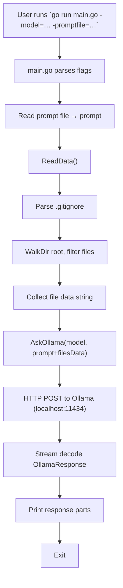

## 🇬🇧 English Documentation (Technical Deep Dive)

### Project Title & Synopsis  
**Ollama Readme Generator** – A lightweight Go tool that automatically constructs a `README.md` by scanning all non‑ignored files in the current directory, appending a user‑supplied prompt, and streaming the response from a locally running Ollama language model.

### How It Works (The Mechanics)

| Component | File | Key Functions / Types | Purpose |
|-----------|------|-----------------------|---------|
| **Main Orchestrator** | `main.go` | `readPromptFile`, `main` | Parses command‑line flags (`-model`, `-promptfile`), reads the prompt template, collects file data via `lib.ReadData()`, and forwards the combined payload to `lib.AskOllama`. |
| **File Collection & Git‑Ignore Handling** | `lib/file-process.go` | `parseGitIgnore`, `isIgnored`, `ReadData` | *`parseGitIgnore`* reads the repository’s `.gitignore` (or creates a default rule set containing `.git`). <br>*`isIgnored`* performs simple glob matching to decide if a path should be excluded. <br>*`ReadData`* walks the current working directory, respects ignored paths, reads each file’s contents, and concatenates them into a single string prefixed with `FileName:` and `Data:` markers. |
| **Ollama Request/Response** | `lib/ollama-sender.go` | `AskOllama`, `OllamaRequest`, `OllamaResponse` | Builds a JSON payload (`model`, `prompt`, `stream:true`), POSTs it to `http://localhost:11434/api/generate`, and decodes the streaming JSON chunks. Each `OllamaResponse` chunk’s `Response` field is printed immediately. The function exits once the `Done` flag is true. |

The tool relies on standard Go libraries (`flag`, `fmt`, `log`, `os`, `path/filepath`, `bufio`, `encoding/json`, `io`, `net/http`, `io/fs`) and no external dependencies.

### Prerequisites

- Go **1.23.0** or newer (specified in `go.mod`).
- A running Ollama server exposing the **/api/generate** endpoint at `http://localhost:11434` (the tool assumes the model is available locally).
- Optional: A `.gitignore` file to exclude unwanted paths.
- `Prompt.md` – a markdown file containing the prompt template; defaults to the file bundled with the executable.

### Usage / Execution

```bash
# Basic usage, redirecting output to README.md
go run main.go -model=gpt-oss > README.md

# Custom model or prompt file
go run main.go -model=my-model -promptfile=/path/to/custom/Prompt.md > README.md
```

The `-model` flag selects the Ollama model name. The `-promptfile` flag points to the prompt template; if omitted, the bundled `Prompt.md` is used. The program logs its progress and prints the generated README to stdout.

---

## 🇹🇷 Turkish Documentation (Tam Teknik Çeviri)

### Proje Başlığı & Özeti  
**Ollama Readme Generator** – Yerel olarak çalışan Ollama dil modeline kod dosyalarını, kullanıcı tarafından sağlanan bir promptu birleştirerek otomatik olarak `README.md` oluşturan hafif bir Go aracıdır.

### Çalışma Mantığı (Mekanik)

| Bileşen | Dosya | Ana Fonksiyon / Türler | Amaç |
|---------|-------|------------------------|------|
| **Ana Koordinatör** | `main.go` | `readPromptFile`, `main` | Komut satırı bayraklarını (`-model`, `-promptfile`) ayrıştırır, prompt şablonunu okur, `lib.ReadData()` ile dosya verilerini toplar ve birleşik yükü `lib.AskOllama`'ya iletir. |
| **Dosya Toplama & Git‑Ignore İşleme** | `lib/file-process.go` | `parseGitIgnore`, `isIgnored`, `ReadData` | *`parseGitIgnore`* repository’nin `.gitignore` dosyasını okur (ya da varsayılan `.git` kural seti oluşturur). <br>*`isIgnored`* basit glob eşlemesiyle yolun dışlanıp dışlanmayacağını belirler. <br>*`ReadData`* geçerli çalışma dizinini dolaşır, dışlanan yolları atar, her dosyanın içeriğini okur ve `FileName:` ve `Data:` işaretleriyle tek bir string içinde birleştirir. |
| **Ollama İstek/Çıkış** | `lib/ollama-sender.go` | `AskOllama`, `OllamaRequest`, `OllamaResponse` | JSON yükü oluşturur (`model`, `prompt`, `stream:true`), `http://localhost:11434/api/generate` adresine POST yapar ve akışlı JSON parçalarını çözer. Her `OllamaResponse` parçasının `Response` alanı hemen ekrana yazdırılır. `Done` bayrağı true olduğunda çıkış yapılır. |

Araç, standart Go kütüphanelerini (`flag`, `fmt`, `log`, `os`, `path/filepath`, `bufio`, `encoding/json`, `io`, `net/http`, `io/fs`) kullanır ve ek bağımlılık yoktur.

### Gereksinimler

- Go **1.23.0** veya üstü ( `go.mod` içinde belirtilmiştir).  
- `http://localhost:11434` adresinde **/api/generate** endpoint'ini açan çalışan bir Ollama sunucusu (aracın yerel modelin mevcut olduğunu varsayar).  
- Opsiyonel: İstenmeyen yolları dışlamak için `.gitignore` dosyası.  
- `Prompt.md` – prompt şablonunu içeren markdown dosyası; paketle birlikte gelen dosya varsayılan olarak kullanılır.

### Kullanım / Çalıştırma

```bash
# Temel kullanım, çıktıyı README.md dosyasına yönlendirme
go run main.go -model=gpt-oss > README.md

# Özel model veya prompt dosyası
go run main.go -model=my-model -promptfile=/path/to/custom/Prompt.md > README.md
```

`-model` bayrağı Ollama model adını seçer. `-promptfile` bayrağı prompt şablonunun yolunu belirtir; verilmezse paketlenmiş `Prompt.md` kullanılır. Program ilerlemesini loglar ve üretilen README'yi stdout'a yazdırır.

---

> Bu dosya AI üzerinden otomatik hazırlanmıştır.

---

## AI Context & Memory

**Summary:**  
The Go program `ollama-readme-generator` orchestrates generation of a README by reading all non‑ignored files in the current working directory, combining their content with a user prompt, and streaming the result from a local Ollama model (via `http://localhost:11434/api/generate`). Key modules: `main.go` (flag parsing, prompt reading, orchestration), `lib/file-process.go` (gitignore parsing, directory walk, file reading), `lib/ollama-sender.go` (HTTP POST, JSON streaming). Uses only standard libraries; requires Go ≥1.23 and a running Ollama server. The README output is printed to stdout, intended to be redirected to a file.
