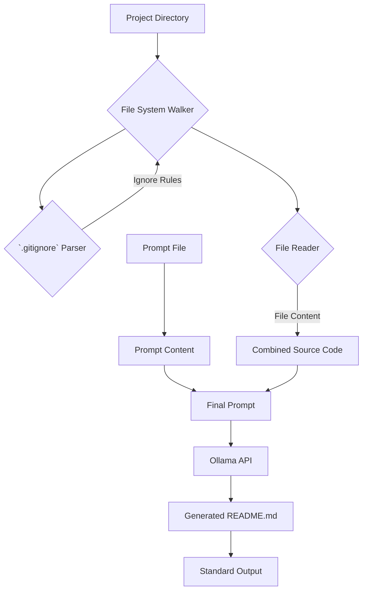

# Ollama README Generator - Documentation

## 1. About

This tool automatically generates a `README.md` file from your project's source code. It reads all the files in your project (excluding those specified in `.gitignore`), combines their content, and sends this combined content as a prompt to an Ollama model (like `gpt-oss`). The model then generates the final `README.md` content, which is printed to standard output. This documentation is created for dummies, ensuring a simple understanding of the project's functionality.

## 2. Entrance

**Why was this code written?**

This project was created to streamline the process of generating `README.md` files for software projects.  Manually writing a good `README` can be time-consuming. This tool automates the process by extracting source code and using an AI model to create a descriptive `README` file.

**Where can this project be used?**

This project is useful for:

*   **Open-source projects:** Quickly generate a `README` to help others understand your code.
*   **Personal projects:** Document your code easily.
*   **Rapid prototyping:** Generate documentation as part of your development workflow.

## 3. Explain

### Core Functionality

The `ollama-readme-generator` project consists of several key components, each with a specific role in generating the `README.md` file. Let's break down how it all works:

1.  **File Reading & `.gitignore` Handling (`lib/file-process.go`)**: This module is responsible for walking through the project directory, reading the content of each file, and respecting the rules specified in the `.gitignore` file.
    *   `parseGitIgnore()`:  Reads the `.gitignore` file and returns a list of file patterns to exclude from processing.
    *   `isIgnored()`: Checks if a given file or directory matches any of the ignore patterns.
    *   `ReadData()`:  The main function that walks the directory, skips ignored files/directories, reads file content, and combines it into a single string.

2.  **Ollama Interaction (`lib/ollama-sender.go`)**: This module handles communication with the Ollama API.
    *   `AskOllama()`: Sends a request to the Ollama API with a specified model and prompt.  It receives the response as a stream of text and prints it to the console.

3.  **Main Application (`main.go`)**: This is the entry point of the application. It orchestrates the entire process.
    *   It parses command-line arguments (model name and prompt file).
    *   It reads the prompt from the specified file.
    *   It calls `lib.ReadData()` to get the combined source code content.
    *   It constructs the final prompt by combining the prompt file content and the source code content.
    *   It calls `lib.AskOllama()` to send the prompt to Ollama and print the generated `README.md` content.

### Data Flow

Here's a diagram illustrating the data flow within the application:



### Code Snippets and Explanation

*   **Reading Files & Ignoring `.gitignore`:**

    ```go
    // lib/file-process.go
    func ReadData() string {
        // ... (code to parse .gitignore and walk the directory) ...
        if !d.IsDir() {
            content, _ := os.ReadFile(path)
            filesDatas += fmt.Sprintf("FileName: %s\n", relPath)
            filesDatas += fmt.Sprintf("Data:\n%s\n\n", string(content))
        }
        return filesDatas
    }
    ```

    This function walks through the project directory, skips ignored files/directories (based on `.gitignore`), and reads the content of each file, appending it to the `filesDatas` string.

*   **Sending Prompt to Ollama:**

    ```go
    // lib/ollama-sender.go
    func AskOllama(modelName string, prompt string) error {
        // ... (code to create HTTP request and send to Ollama API) ...
        decoder := json.NewDecoder(resp.Body)
        for {
            var part OllamaResponse
            if err := decoder.Decode(&part); err == io.EOF {
                break
            } else if err != nil {
                return err
            }
            fmt.Print(part.Response)
            if part.Done {
                break
            }
        }
        return nil
    }
    ```

    This function sends the constructed prompt to the Ollama API, streams the response, and prints it to the console.

## 4. Usage Examples

1.  **Basic Usage:**

    ```bash
    go run main.go > README.md
    ```

    This command will generate a `README.md` file using the default model (`gpt-oss`) and the default prompt file (`Prompt.md`).

2.  **Specify Model:**

    ```bash
    go run main.go -model=llama2 > README.md
    ```

    This command will use the `llama2` model to generate the `README.md` file.

3.  **Specify Prompt File:**

    ```bash
    go run main.go -promptfile=my_prompt.txt > README.md
    ```

    This command will use the `my_prompt.txt` file as the prompt for generating the `README.md` file.

## 5. Conclusion

The `ollama-readme-generator` simplifies the process of creating `README.md` files. By automatically extracting source code and using the power of AI models like Ollama, it saves developers time and effort.  This tool is useful for both open-source and personal projects, helping to create clear and informative documentation. This project is used for make documentation process easy and fast.

That explanation created from AI.

**AI Context & Memory**

This project automates `README.md` generation. It walks a directory, respecting `.gitignore`, reads file contents, and sends a combined prompt to an Ollama model via HTTP POST request. The model's streamed response is then printed to stdout, effectively creating the `README`.  Key variables include `modelName` (Ollama model), `promptFile` (path to introductory prompt), and `filesData` (combined source code). The core functions are `ReadData` (file system traversal and content extraction) and `AskOllama` (API interaction and response streaming). Command-line arguments control the model and prompt file.

